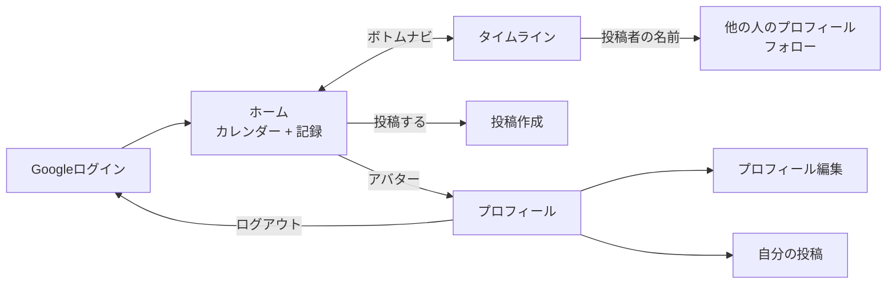

# OKIBI 設計メモ

画面遷移とデータモデルの設計です。実装の状況は [README](../README.md) を参照してください。

## 設計の原則

- **ランキング・比較の演出を作らない**(最重要)
- 数値(記録日数など)は**本人にだけ**表示する。他人には見た目だけを見せる
- 連続日数(ストリーク)によるプレッシャーを作らない。週に一度でも続けていれば十分、という頻度に寛容な設計にする
- 誤操作で記録が消えないようにする

## 画面遷移

日々使うのは、ホーム・タイムライン・投稿作成・プロフィールの4画面です。

## データモデル(Cloud Firestore)

✅ は実装済み、🚧 は未実装です。

### `users/{uid}` ✅

| フィールド | 型 | 説明 |
|---|---|---|
| `displayName` | string | 表示名 |
| `avatarType` | string | `"icon"` \| `"photo"`。写真は未対応(Cloud Storageが必要) |
| `avatarIconId` | string? | アイコンID(12種) |
| `avatarColorId` | string? | 色ID(8色)。アイコンと組み合わせて96通り |
| `avatarPhotoUrl` | string? | 写真のURL(将来用) |
| `statusMessage` | string | 一言ステータス |
| `genreTags` | array\<string\> | 選択中のジャンル(3つまで) |
| `visibility` | string | 投稿の公開範囲の既定値(将来用) |
| `firstPostMonth` | timestamp? | 初回投稿の月。月次AI振り返りの起点に使う |
| `recordDayCount` | number | 記録日数。**本人にのみ表示** |
| `createdAt` | timestamp | 作成日時 |

### `stamps/{uid_YYYY-MM-DD}` ✅

カレンダーのワンタップ記録。1日1件で、ドキュメントIDに日付を含めます。

| フィールド | 型 | 説明 |
|---|---|---|
| `uid` | string | 押した本人 |
| `date` | string | `"YYYY-MM-DD"` |
| `templateId` | string | 定型項目のID(今は `"default"` のみ) |
| `note` | string? | 「一言添える?」への回答(140字まで) |
| `createdAt` | timestamp | 押した日時 |

### `posts/{postId}` ✅

| フィールド | 型 | 説明 |
|---|---|---|
| `authorUid` | string | 投稿者 |
| `text` | string | 本文(500字まで) |
| `photoUrl` | string? | 添付写真(将来用) |
| `genreTag` | string | ジャンルタグ(1件) |
| `isPublic` | boolean | 公開/非公開。既定は公開 |
| `reactionCount` | number | 炎リアクションの数 |
| `createdAt` | timestamp | 投稿日時 |

### `follows/{followerUid_followeeUid}` ✅

| フィールド | 型 | 説明 |
|---|---|---|
| `followerUid` | string | フォローする側 |
| `followeeUid` | string | フォローされる側 |
| `createdAt` | timestamp | フォローした日時 |

ドキュメントIDは `フォローする人_される人` に固定します。フォロー数・フォロワー数は、このコレクションの件数から数えます。

### `reactions/{postId}_{uid}` ✅

炎リアクション。1人1投稿につき1件で、ドキュメントIDに投稿IDと反応した人を含めます。

| フィールド | 型 | 説明 |
|---|---|---|
| `postId` | string | 反応した投稿 |
| `uid` | string | 反応した人 |
| `createdAt` | timestamp | 反応した日時 |

投稿側の `reactionCount` はこのコレクションの増減に合わせてトランザクションで±1します(下記「未決定の事項」参照)。

### `monthlyReflections/{uid_YYYY-MM}` 🚧

`uid`、`month`、`promptQuestion`(AIが生成した問い)、`answerText`、`isPublic`、`createdAt`

## セキュリティルール

`firestore.rules` に定義しています。基本は「ログイン済みユーザーだけが読める。書き込めるのは自分のデータだけ」です。

- `users`: 誰でも読める。書けるのは本人だけ
- `stamps`: 書き込み・削除は本人だけ
- `posts`: **非公開の投稿は本人だけが読める**。書き込み・削除は投稿者だけ
- `follows`: 作成・削除は、フォローする本人だけ。**自分自身はフォローできない**。ドキュメントIDは `フォローする人_される人` でなければ作れない
- `reactions`: 作成・削除は、その操作をする本人だけ。ドキュメントIDは `投稿ID_反応する人` でなければ作れない(なりすまし防止)
- `posts` の更新は原則、投稿者本人だけ。ただし例外として、**`reactionCount` だけを±1する更新**は、投稿者以外の署名済みユーザーにも許可しています(炎リアクションのため)

## クエリとインデックス

| 用途 | クエリ | インデックス |
|---|---|---|
| カレンダー(1か月分) | ドキュメントIDの範囲 `uid_YYYY-MM-01` 〜 `uid_YYYY-MM-31` | 不要 |
| タイムライン | `isPublic == true` **OR** `authorUid == 自分`、`createdAt` の降順 | `posts`: (`isPublic`, `createdAt`) と (`authorUid`, `createdAt`) |
| 自分の投稿 | `authorUid == 自分`、`createdAt` の降順 | `posts`: (`authorUid`, `createdAt`) |
| 他の人の公開投稿 | `authorUid == その人` かつ `isPublic == true`、`createdAt` の降順 | `posts`: (`authorUid`, `isPublic`, `createdAt`) |
| タイムライン「フォロー中」 | `authorUid in [フォロー中の人]` かつ `isPublic == true`、`createdAt` の降順 | 同上 |

「フォロー中」は、Firestoreの `in` が一度に30件までしか指定できないため、フォローが30人を超えると、
UIDの並び順で先頭の30人だけが対象になります。検証の段階では問題にならない人数なので、この上限のままにしています。

セキュリティルールは「クエリの結果が必ずルールを満たす」ことを求めます。タイムラインの取得は、
「公開」か「自分」のどちらかで必ず絞り込むことで、他人の非公開の投稿が読めないルールを満たしています。

## 未決定の事項

- ホーム画面の見出しの文言(「今頑張ってる人」はランキングのように見えるおそれがある)
- 写真アバター・写真添付(Cloud Storageの料金プランを決めてから)
- 月次AI振り返り(Cloud Functionsの料金プランを決めてから)

## 設計の割り切り

- **リアクションの集計**: `reactionCount` を非正規化する方式にしました(`reactions` を毎回 `count()` で数える方式ではない)。Cloud Functionsを使わずにリアルタイム表示するためです。セキュリティルールで「reactionCountだけを±1する更新」を投稿者以外にも許可しているため、理屈の上では reactions ドキュメントを作らずに `reactionCount` だけを操作するクライアントも書けてしまいます。個人開発のポートフォリオという前提で、この程度の割り切りは許容しています
- **リアクションの数は誰でも見える**(投稿だけに小さく表示)。「ランキング・比較の演出を作らない」原則と一見矛盾するようだが、この原則の本質は**冷笑・マウント文化を持ち込まないこと**であり、数値そのものの排除ではないと整理した(2026-09-23、本人判断)。矛盾しないために、今後も次の2点は守る:
  1. 反応数で投稿を並べ替えたり、「人気投稿」のような機能は作らない(タイムラインは時系列順のみ)
  2. プロフィールなど**人単位**で反応数を合計・表示する機能は作らない(投稿単位の小さな数はよいが、人同士を比較できる指標にはしない)
